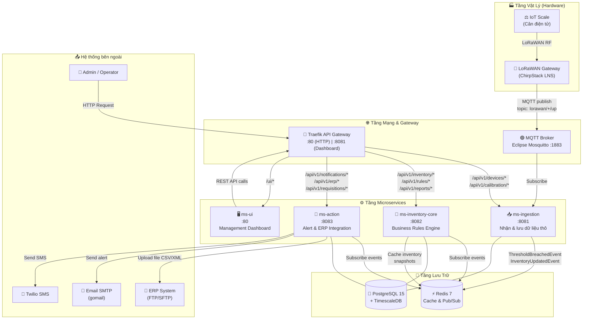
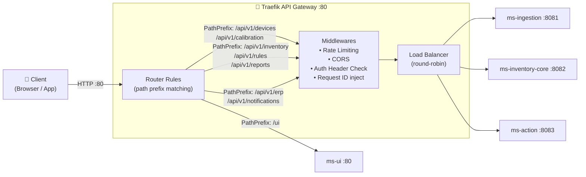
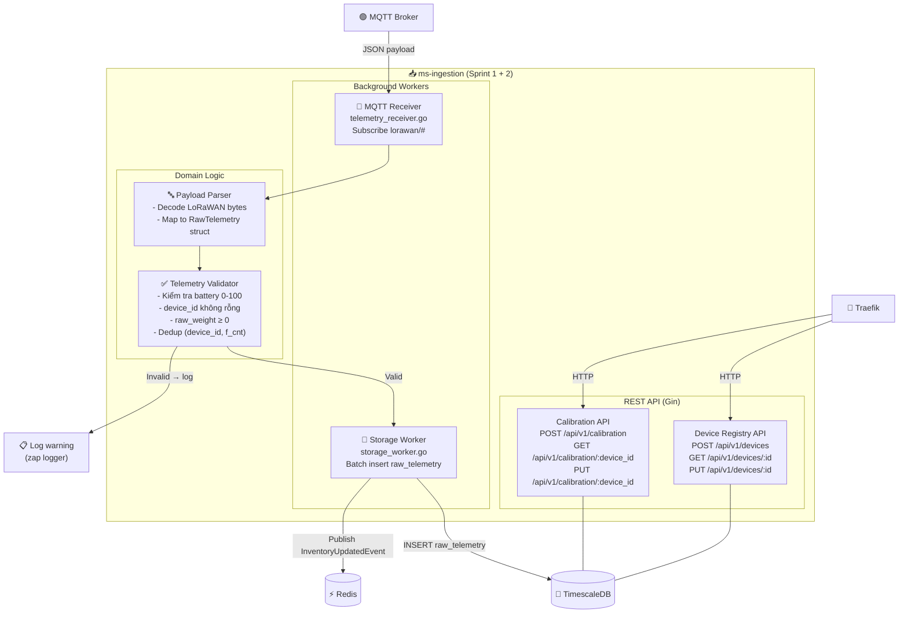
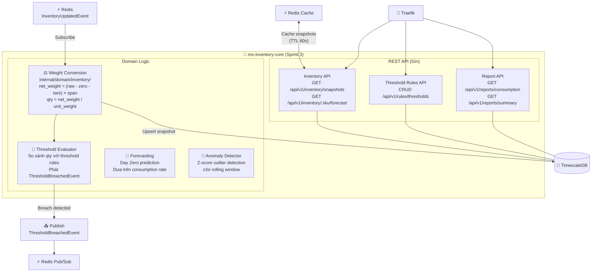
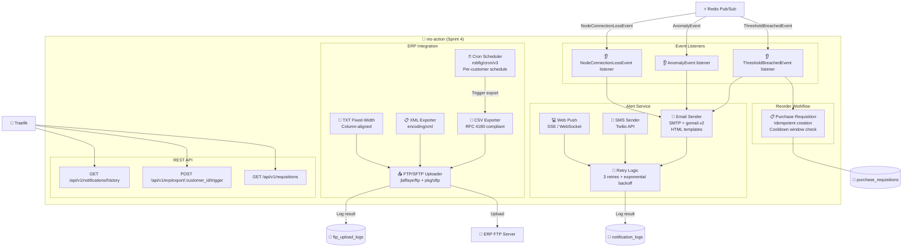
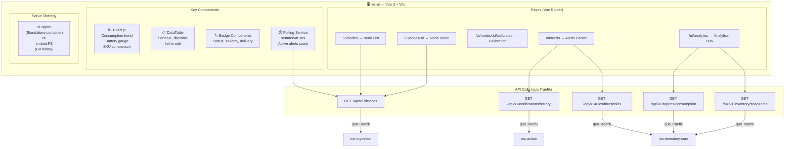
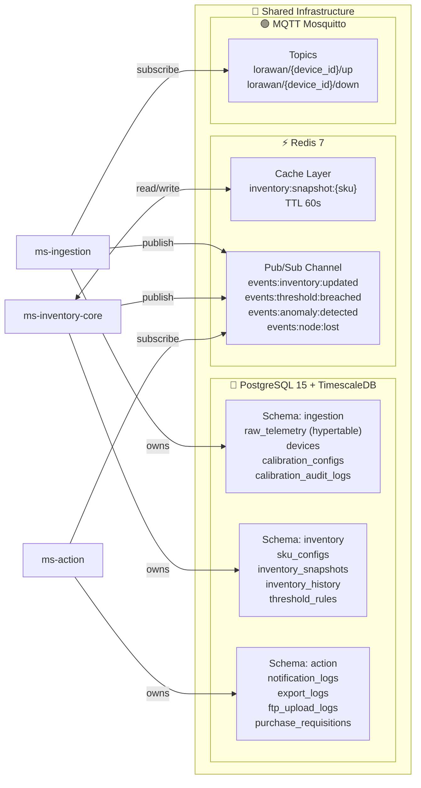
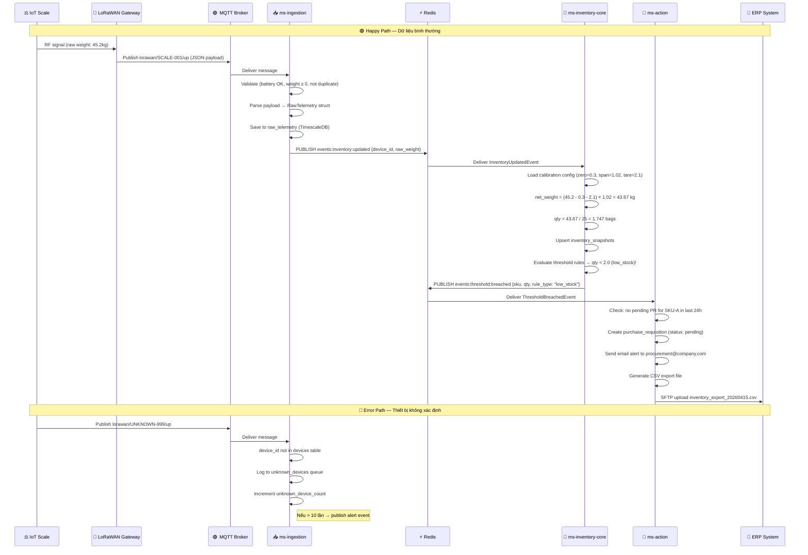
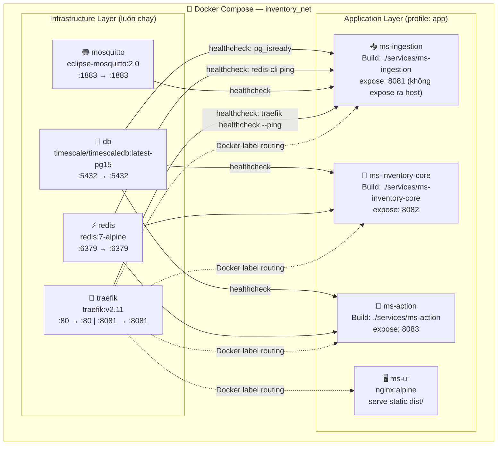
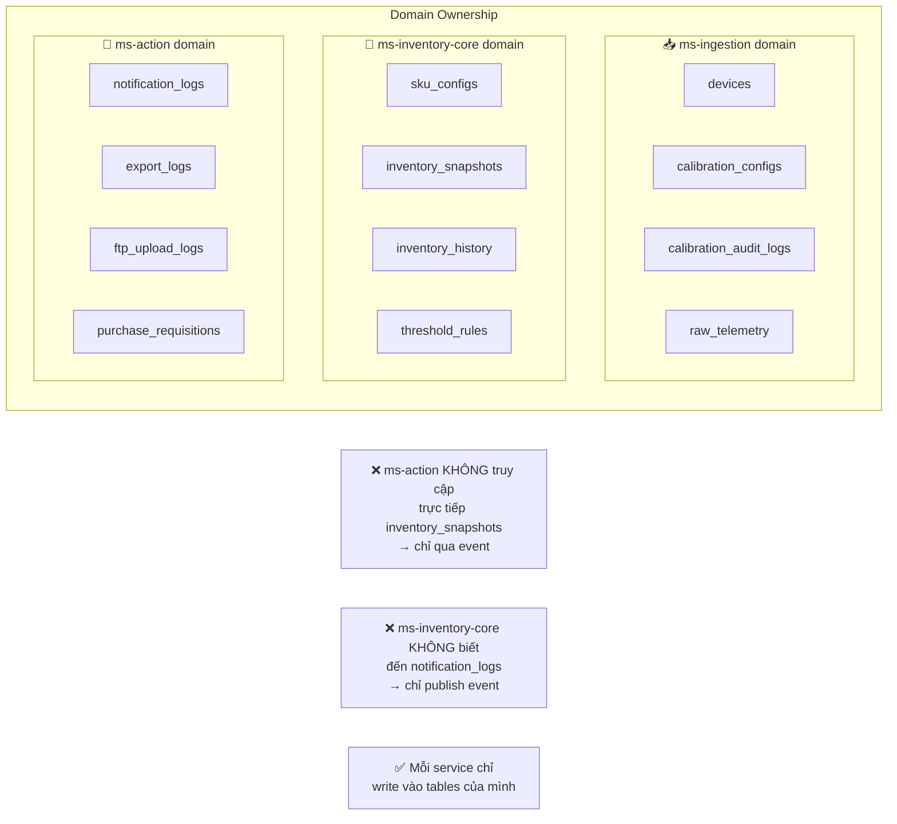

# Kiến trúc Microservice — Inventory Management System
> Tài liệu giải thích trực quan từng thành phần  
> Project: IoT Scale Inventory | Golang | FDA 21 CFR Part 11

---

## 1. Bức tranh tổng thể



---

## 2. Giải thích từng thành phần

---

### 🔀 Traefik — API Gateway (Cổng vào duy nhất)



**Traefik là gì?**  
Giống như **lễ tân của một tòa nhà** — tất cả khách (request) đều vào qua 1 cửa duy nhất. Traefik sẽ:
1. Kiểm tra request (authentication, rate limiting)
2. Inject thêm thông tin (`X-Request-ID`, `X-Trace-ID`)
3. Chuyển đến đúng service phía sau dựa trên URL path

**Config hiện tại** (bạn đã có `traefik/traefik.yml` và `traefik/dynamic.yml`):
- `:80` → HTTP entrypoint (route requests)
- `:8081` → Traefik dashboard (monitoring)

---

### 📥 ms-ingestion — Tầng Nhận Dữ Liệu



**ms-ingestion làm gì?**

| Trách nhiệm | Chi tiết |
|-------------|---------|
| **Nhận dữ liệu từ cân** | Subscribe MQTT topic `lorawan/+/up`, decode JSON payload |
| **Validate** | Battery 0-100, device_id không rỗng, raw_weight ≥ 0, loại bỏ duplicate |
| **Lưu trữ** | Batch insert vào TimescaleDB hypertable `raw_telemetry` |
| **Quản lý thiết bị** | CRUD devices, CRUD calibration config, audit trail |
| **Publish event** | Sau mỗi telemetry hợp lệ → publish `InventoryUpdatedEvent` |

**Tables owned:**
- `raw_telemetry` (hypertable — time-series)
- `devices`
- `calibration_configs`
- `calibration_audit_logs`

---

### 🧮 ms-inventory-core — Business Rules Engine



**ms-inventory-core làm gì?**

| Trách nhiệm | Chi tiết |
|-------------|---------|
| **Weight Conversion** | `net_weight = (raw_weight - zero_offset - tare) × span_factor` |
| **Inventory Calculation** | `qty = net_weight_kg / unit_weight_kg` → upsert `inventory_snapshots` |
| **Threshold Evaluation** | Kiểm tra qty với rules → publish event nếu breach |
| **Forecasting (Sprint 3)** | Tính `days_remaining` và `day_zero_date` dựa trên consumption trend |
| **Anomaly Detection (Sprint 3)** | Z-score cho từng device, đánh dấu `suspect=true` |
| **Reporting API** | Query consumption trend từ `inventory_history` (TimescaleDB) |

**Tables owned:**
- `sku_configs`
- `inventory_snapshots`
- `inventory_history`
- `threshold_rules`

---

### 🔔 ms-action — Alert & ERP Integration Layer



**ms-action làm gì?**

| Trách nhiệm | Chi tiết |
|-------------|---------|
| **Alert Service** | Nhận events → gửi Email/SMS/Push; retry 3 lần; log kết quả |
| **ERP Export** | Tạo file CSV/TXT/XML theo config từng khách hàng |
| **FTP Upload** | Schedule upload tự động theo cron; manual trigger qua API |
| **Reorder Workflow** | Tạo Purchase Requisition khi low_stock; idempotent (cooldown) |

**Đặc điểm quan trọng:**  
`ms-action` **không pull dữ liệu trực tiếp** từ ms-inventory-core. Nó **lắng nghe events** từ Redis Pub/Sub. Đây là **loose coupling** — ms-action không biết ms-inventory-core tồn tại.

**Tables owned:**
- `notification_logs`
- `export_logs`
- `ftp_upload_logs`
- `purchase_requisitions`

---

### 🖥️ ms-ui — Management Dashboard



**ms-ui làm gì?**

| Screen | Nội dung |
|--------|---------|
| **Node List** | Bảng thiết bị: status badge, battery bar, last_seen; sort/filter |
| **Node Detail** | Edit metadata, toggle `maintenance_mode`, lịch sử calibration |
| **Calibration Screen** | Xem/cập nhật zero, span, tare, unit; form submit new calibration |
| **Alerts Center** | Threshold rules CRUD; active alerts; notification history log |
| **Analytics Hub** | Consumption trend chart; Day Zero prediction; Anomaly log; RSSI/SNR |

---

### 💾 Shared Infrastructure



---

## 3. Event Flow — Luồng dữ liệu end-to-end



---

## 4. Docker Compose Topology



**Cách dùng:**
```bash
# Chỉ infra (DB + MQTT + Redis + Traefik)
docker compose up -d

# Tất cả services
docker compose --profile app up

# Xem dashboard Traefik
open http://localhost:8081
```

---

## 5. Ranh giới trách nhiệm (Ownership Boundary)



---

## 6. Tóm tắt — Mỗi service một câu

| Service | Câu mô tả ngắn gọn |
|---------|-------------------|
| **Traefik** | "Người bảo vệ cửa" — nhận tất cả request từ bên ngoài, kiểm tra, rồi chuyển đến đúng service |
| **ms-ingestion** | "Người nhận hàng" — nhận tín hiệu từ cân, validate, lưu vào database thô, quản lý thiết bị |
| **ms-inventory-core** | "Kế toán trưởng" — tính toán tồn kho thực tế từ số liệu thô, áp dụng business rules, dự báo |
| **ms-action** | "Người phản ứng" — nhận tín hiệu cảnh báo, gửi email/SMS, xuất file ERP, tạo đơn mua hàng |
| **ms-ui** | "Mặt tiền cửa hàng" — dashboard web cho operator nhìn vào hệ thống và điều chỉnh |
| **PostgreSQL + TimescaleDB** | "Kho lưu trữ" — lưu tất cả dữ liệu, time-series cho raw_telemetry |
| **Redis** | "Bảng thông báo + bộ nhớ nhanh" — truyền events giữa services, cache snapshot tồn kho |
| **MQTT Broker** | "Trạm phát thanh" — nhận tín hiệu từ cân IoT qua mạng LoRaWAN, broadcast cho subscriber |

---

*Tài liệu này mang tính educational — không thay đổi code. Sprint tasks sẽ được tạo sau khi kiến trúc được approve.*
